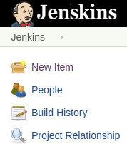
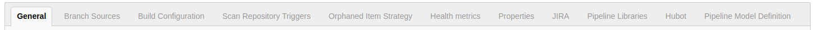
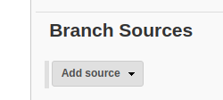
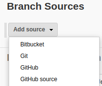
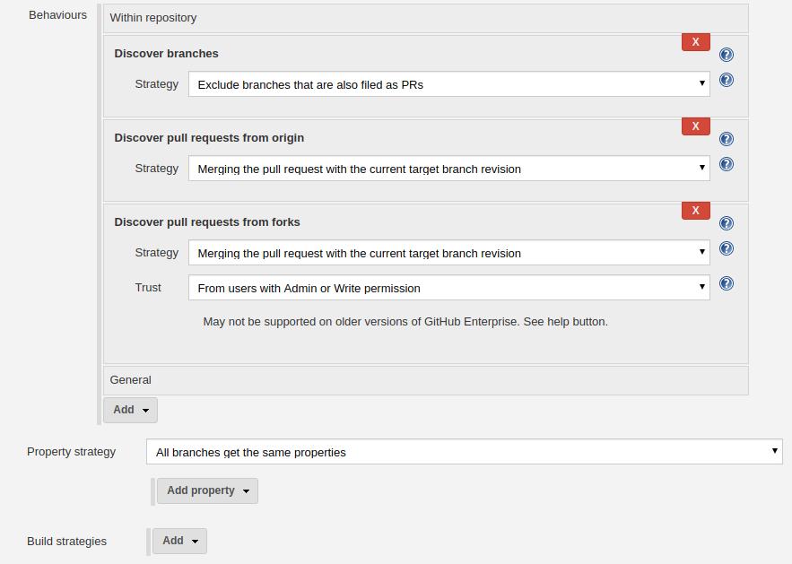
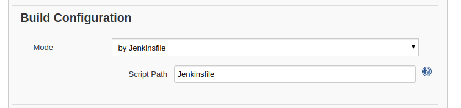
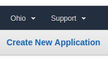
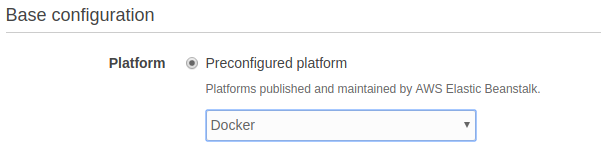
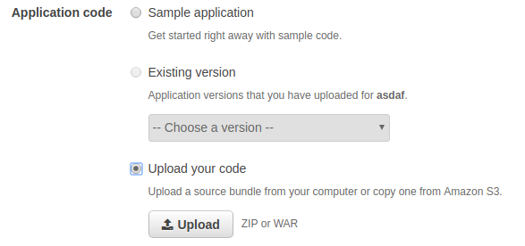

#### Prerequisites

  - GitHub repo
  - Jenkins account
  - AWS account
  - Docker account
  - Webhooks on GitHub repo

<br>

## GitHub setup

### Set collaborator

Might be needed to delegate permission to the repo. Go to:

   - Settings 
   - Collaborators & Teams
   - Add collaborator

### Set webhook

   - Settings 
   - Webhooks
   - Add webhook

<br>

### Set Jenkinsfile


## Jenkins setup

### Create Jenkins job

1. Go **"New item"**




2. Name your project, and select:

```
**Multibranch Pipeline**
```

<br>

### Configure job

You will see tabs to go through:




1. **Branch sources**

Hit "Add source"




Select "GitHub" from dropdown:



**Fill!!**

 - Credentials
 - Owner
 - Repository

```
NOTE: You might have to wait a bit for Jenkins to retreive Repositories after you set Owner.
```

Fill the rest accustomed by your needs, or go deafult, like:



<br>

2. Build configuration



<br>

### Set up credentials in Jenkins for:

  - Docker
  - AWS
    
<br>

## EB setup - create application and environment

[Login to AWS Console](https://console.aws.amazon.com/console/home) and go to Elastic Beanstalk service.

Create new application.



<br>

Create new environment.


<br>

Setup environment:

 - Select Web server environment
 - Select Platform: Docker
 
 
 
 - Upload first version of application as .zip or .war. 
 
 **This version will be required in Jenkinsfile as parameter.**
 
 
 
 Let AWS initialize instance.
 
 ```
 Note: AWS Elastic Beanstalk will create other tools as dependencies: VPC, EC2, S3... 
 in case you need to clean up after the task is done, make sure to delete/terminate those as well 
 or contact support in case of need.
```

<br>

## Setup Jenkinsfile

You will need to add Jenkinsfile to the repo for Jenkins pipeline to be able to follow commands.

Your Jenkinsfile should look somehow like this:

**Follow through code and replace pieces between signs <> ... <> with your own code.**

```
pipeline {
  environment {
    registry = '<>user_name/docker_image_name<>'
    dockerCred = '<>docker_credentials_from_jenkins<>'
    dockerImage = ''
  }  
 agent any
  stages {
    stage('<>Testing<>') {
      steps {
        sh 'npm init -y'
        sh 'npm install'  
        sh 'node <>test.js<>'
     }
   }
  stage('<>Building image<>') {
      steps{
        script {
          docker.build registry + ":$BUILD_NUMBER"
       }
     }
   } 
   stage('Deploy Image') {
      steps{
        script {
          docker.withRegistry( '', dockerCred ) {
            sh 'docker push adambhun/multibranch-ci-cd:latest'
         }
       }
     }
   }
   stage('<>Deploy to EB<>') {
      when {
        branch 'master'
      }
      steps{
        withCredentials([[$class: 'AmazonWebServicesCredentialsBinding', accessKeyVariable: 'AWS_ACCESS_KEY_ID', credentialsId: '<>environment_name_of_EB_application<>', secretKeyVariable: 'AWS_SECRET_ACCESS_KEY']]) {
          sh 'pip install awsebcli --upgrade --user'
          sh 'eb deploy <>environment_name<> --version <>environment_version<>'
        }
      }
    }
    stage('<>Cleanup<>') {
      steps{
        sh 'docker rmi $registry:$BUILD_NUMBER'
        sh 'rm -r node_modules'
        sh 'rm package.json'
      }
    }
  }
}
  
```

**For better understanding of pipeline syntax, please visit [this site](https://jenkins.io/doc/book/pipeline/syntax/)**
