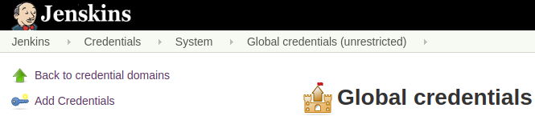
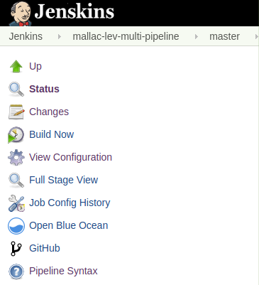
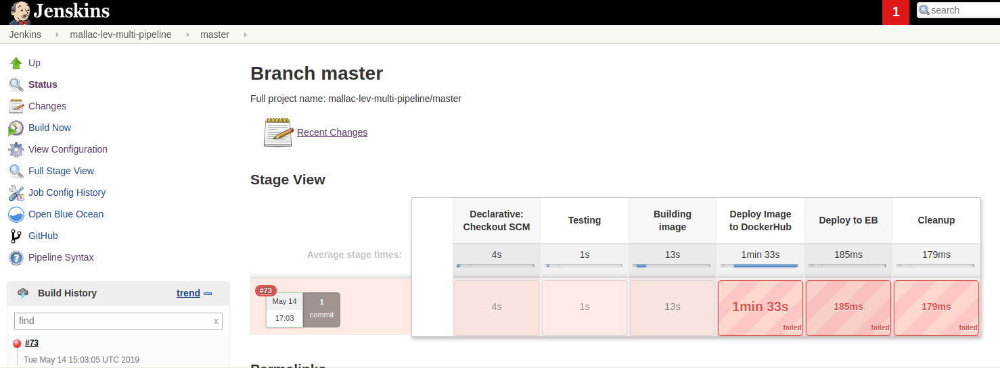
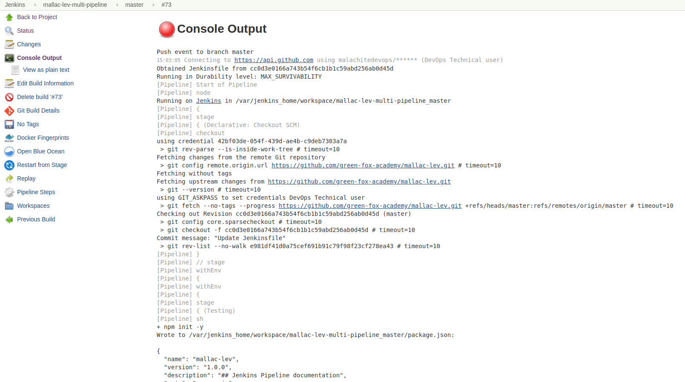
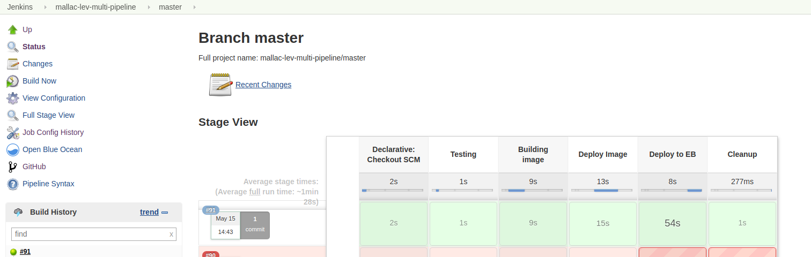

#### Prerequisites

  - GitHub repo
  - Jenkins account
  - AWS account
  - Docker account
  - Webhooks on GitHub repo

<br>

## GitHub setup

### Set collaborator

Might be needed to delegate permission to the repo. Go to:

   - Settings 
   - Collaborators & Teams
   - Add collaborator

### Set webhook

   - Settings 
   - Webhooks
   - Add webhook

<br>

### Set Jenkinsfile


## Jenkins setup

### Create Jenkins job

1. Go **"New item"**


2. Name your project, and select:

```
**Multibranch Pipeline**
```

<br>

### Configure job

You will see tabs to go through:


1. **Branch sources**

Hit "Add source"


Select "GitHub" from dropdown:


**Fill!!**

 - Credentials
 - Owner
 - Repository

```
NOTE: You might have to wait a bit for Jenkins to retreive Repositories after you set Owner.
```

Fill the rest accustomed by your needs, or go deafult, like:


<br>

2. Build configuration


<br>

### Set up credentials in Jenkins for:

  - Docker
  - AWS
  

    
<br>

## EB setup - create application and environment

[Login to AWS Console](https://console.aws.amazon.com/console/home) and go to Elastic Beanstalk service.

Create new application.


<br>

Create new environment.


<br>

Setup environment:

 - Select Web server environment
 - Select Platform: Docker
 
 
 
 - No need to upload first version of application. 
 
  
 
 
 
 Let AWS initialize instance.
 
 ```
 Note: 
 
 1) AWS Elastic Beanstalk will create other dependencies such as: VPC, EC2, S3... 
 In case you need to clean up after the task is done, make sure to delete/terminate those as well 
 or contact support in case of need.
 
 2) To be able to initialize environment AWS will require a default VPC where all the depencis will be able to connect.
 
```

<br>

## Setup Jenkinsfile

You will need to add Jenkinsfile to the repo for Jenkins pipeline to be able to follow commands.

This pipeline project will go through these stages:

 - Pull github repo content upon change based on webhook.
 - Test the code.
 - Build docker image from the code.
 - Deploy the image to docker hub.
 - Deploy image to AWS Elastic Beanstalk.
 - Remove docker image from Jenkins.
 
 <br>

Your Jenkinsfile should look somehow like this:

**Follow through code and replace pieces between signs <> ... <> with your own code.**

```
pipeline {
  environment {
    registry = "<>docker_user_name/docker_image<>"
    dockerCred = '<>docker_credentials_in_jenkins<>'
    dockerImage = ''
  }
  agent any
  stages {
    stage('Testing') {
      steps {
        sh 'npm init -y'
        sh 'npm install'        
        }
      }
    stage('Building image') {
      steps{
        script {
          dockerImage=docker.build registry + ":$BUILD_NUMBER"
        }
      }
    }
    stage('Deploy Image') {
      steps{
        script {
          docker.withRegistry( '', dockerCred ) {
            dockerImage.push()
            dockerImage.push('latest')
          }
        }
      }
    }
    stage('Deploy to EB') {
      when {
        branch 'master'
      }
      steps{
        withCredentials([[$class: 'AmazonWebServicesCredentialsBinding', accessKeyVariable: 'AWS_ACCESS_KEY_ID', credentialsId: 'bubuska-eb', secretKeyVariable: 'AWS_SECRET_ACCESS_KEY']]) {
          sh 'pip install awsebcli --upgrade --user'
          sh 'echo "1" | eb init <>aws-eb-application-name<> --region <>us-east-2<> && eb use <>aws-eb-environment-name<> && eb deploy <>aws-eb-environment-name<>'
        }
      }
    }
    stage('Cleanup') {
      steps{
        sh 'docker rmi $registry:$BUILD_NUMBER'
        sh 'rm -r node_modules'
        sh 'rm package.json'
      }
    }
  }
}
  
```

**For better understanding of pipeline syntax, please visit [this site](https://jenkins.io/doc/book/pipeline/syntax/)**

<br>

## Test Jenkins pipeline

Login to Jenkins, go to your project.

#### Build 

In the master branch panel, you should see a menu on the left:



Click on button: **"Build Now"**.

It will build your pipeline, should look like this:


If all goes well, every modification in the GitHub repo will trigger this build event and modify the website or application.

<br>

#### Build failed / Debugging

If something goes wrong, you should see something like this:



**Build History** is on the left under the menu, click on the dropdown next to the build number.

Select **"Console Output"**.

This will redirect to the console log page, where you can see what is the cause of error.

It should look like something like this:



'God Help us all!'

<br>

**SUCCESS**


