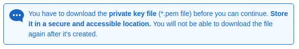

# Elastic Cloud Computing Documentation

### Prerequisites

  - AWS account
  - IAM user

<br>

## Create and launch EC2 Instance

Log into Amazon EC2 Console [link](https://console.aws.amazon.com/ec2/) .


On EC2 Dashboard (on the left) click on button "Launch Instance".

<br>

1. **Choose AMI**

Choose an Amazon Machine Image (AMI): "Amazon Linux AMI" then click on button "Select".

<br>


2. **Choose Instance Type**

Choose an Instance Type: "t2.micro" (free tier / general purpose) then click on button "Next: Configure Instance Details".

<br>

3. **Configure Instance**

You can go with default settings for now, then click on button "Next: Add Storage"

<br>

4. **Add storage**

You can go with default settings for now, then click on button "Next: Add Tags"

<br>

5. **Add tags**

Click on button "Add tag" and set a key.

[If help needed, click on this link.](https://docs.aws.amazon.com/AWSEC2/latest/UserGuide/Using_Tags.html?icmpid=docs_ec2_console)

Click on button: "Next: Configure Security Group"

<br>

6. **Configure Security Group**

On this page, you can add rules to allow specific traffic to reach your instance.

Here you can choose to assign an existing security group, or create new one.

  - Type: SSH
  - Protocol: TCP
  - Port Range: 22
  - Source: 0.0.0.0 !WARNING!


  - Description: [OPTIONAL]

```
**!NOTE!** You can configure the EFS file system to mount on your EC2 instance automatically. 

For more information, see [Configuring an EFS File System to Mount Automatically at EC2 Instance Launch](https://docs.aws.amazon.com/efs/latest/ug/mount-fs-auto-mount-onreboot.html#mount-fs-auto-mount-on-creation).
```
<br>
If ready, click on button: "Review and Launch"

If all in order, click on button: "Launch"

<br>

7. **Select Key Pair (.pem)**

"A key pair consists of a public key that AWS stores, and a private key file that you store. Together, they allow you to connect to your instance securely."

Now you have to provide existing key pair or create new one from dropdown.

**Download Key Pair** and make sure it is safely stored.



Click on button: "Launch Instance" and wait for 1-2 minutes for AWS to start your server.

<br>

8. **Launch status**

If all went well, you should see something like this:


Click on button: "View instances" (bottom right)

It will redirect to the list of instances where you can see on the "Instance State" tab the "running status" in green.

 

<br>

**Your instance is now ready to use!**


