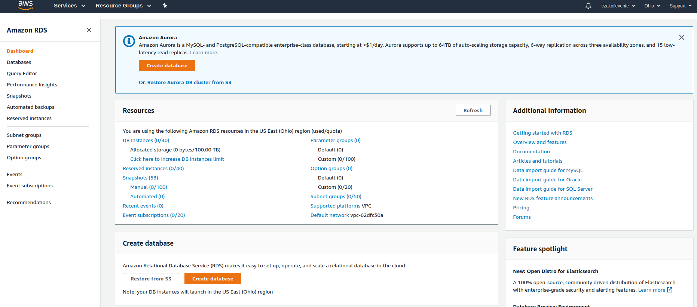
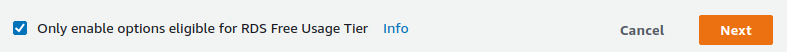
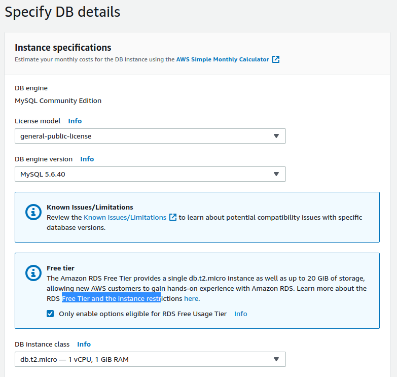
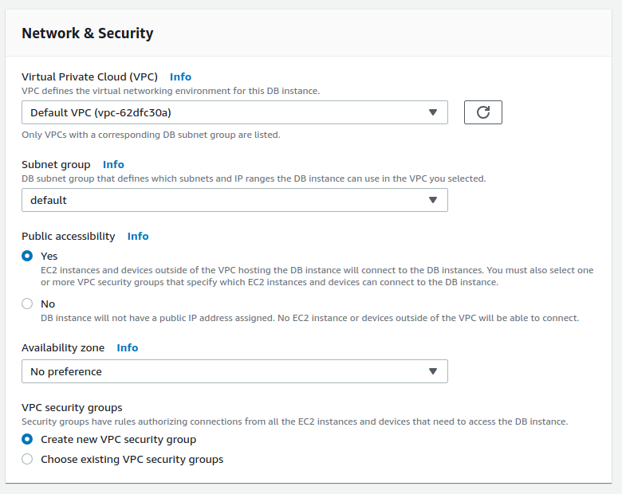
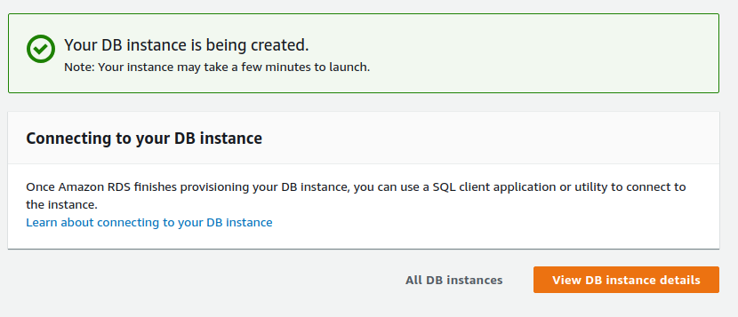

# HOW TO CREATE MySQL DATABASE USING AWS RDS

(free service)

<br>

### Prerequisites

  - AWS account

<br>

## Create database

Login to AWS Console

It should display the AWS Management Console "dashboard".

Type in the searchfield "Find Services":

```
rds

```

then hit Enter.

<br>

It will redirect to RDS Dashboard, you should see "Amazon RDS" on the left.

<br>

1. **RDS Dashboard**

If this is the first time to create database, you can just hit button "Create database"...




...or go to menupoint: "Databases" and find button "Create database" in the top right corner.

<br>

2. **Select engine**

Now you should see the databases listed in squares.

Check if you are using free service.



Select MySQL.

Hit "Next".

<br>

3. **Specify DB details**

you should see something like this:



if you need more specified setting, set it.
<br>

Scroll down for "Settings pane".

Set 

 - DB instance identifier
 - Master username
 - Master password (requires confirmation)

...hit button "Next".

<br>

4. **Configure advanced settings**

* **Network & Security**

Use default values and make sure it is set to public.



<br>

* **Database options**

Set name, port of your database...

**...the rest of the settings can be left as default.**

Hit button "Create database" on the bottom of the page.

Upon success, you should see something like this:



<br>

**Now your database has been created**
