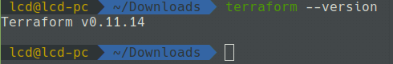

# Infrastructure as Code

## How to create multiple environments automatically with Terraform

<br>

### What is Terraform?

Terraform is a tool made by Hashicorp for building, changing, and versioning infrastructure safely and efficiently. Terraform can manage existing and popular service providers ( aws, azure, Google cloud) as well as custom in-house solutions.

**Development, Test, QA, and Production Environments**

A QA environment is where you test your upgrade procedure against data, hardware, and software that closely simulate the Production environment and where you allow intended users to test the resulting Waveset application.

[...from terraform documentation:](https://www.terraform.io/intro/use-cases.html)
It is common practice to have both a production and staging or QA environment. These environments are smaller clones of their production counterpart, but are used to test new applications before releasing in production. As the production environment grows larger and more complex, it becomes increasingly onerous to maintain an up-to-date staging environment.

Infrastructure is described using a high-level configuration syntax. This allows a blueprint of your datacenter to be versioned and treated as you would any other code. Additionally, infrastructure can be shared and re-used.

Terraform has a "planning" step where it generates an execution plan. The execution plan shows what Terraform will do when you call apply. This lets you avoid any surprises when Terraform manipulates infrastructure.

<br>

## Installation

[Go to terraform's download site.](https://www.terraform.io/downloads.html)

For linux installation follow these commands [source](https://askubuntu.com/questions/983351/how-to-install-terraform-in-ubuntu)

 **1. Install Unzip**

```
$ sudo apt-get install unzip

```

 **2. [Download](https://www.terraform.io/downloads.html) latest version of the terraform:**

```
$ wget https://releases.hashicorp.com/terraform/0.11.14/terraform_0.11.14_linux_amd64.zip

```

 **3. Extract the downloaded file archive:**

```
$ unzip terraform_0.11.14_linux_amd64.zip
```

 **4. Move the executable into a directory searched for executables:**

```
$ sudo mv terraform /usr/local/bin/
```

 **5. Run it:**

```
$ terraform --version 
```

Success should look like this in terminal:




<br>

## First project with Terraform

**This step is OPTIONAL, though I _highly recommend it_ in case You are new to this tool.**

**It will guide You through the basics of managaging Workspaces with the help of descriptive explanations and screenshots.**

[TERRAFORM TUTORIAL](https://learn.hashicorp.com/terraform/getting-started/install)

*Total estimated time of the full tutorial: 75 mins .*

<br>

## 

