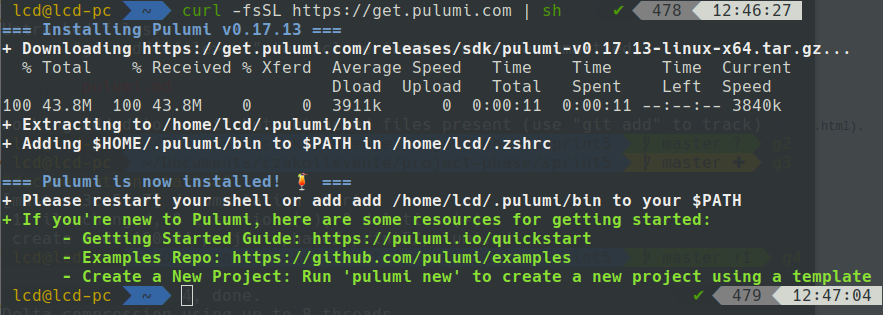

# Pulumi

### What is [Pulumi](https://www.pulumi.com/)?

A single workflow for provisioning cloud apps and infrastructure, in any cloud environment, public, private, or hybrid.

Pulumi enables `developers` to write code in their favorite language (e.g., JavaScript, Python, Go), 
deploying cloud apps and infrastructure easily, without the need to learn specialized DSLs or YAML templating solutions.

Pulumi enables `operators` to achieve continuous delivery of cloud apps and infrastructure to any cloud environment like
AWS, Azure, GCP, Kubernetes, and even hybrid and on-premises envioronments.

*In other way?
Pulumi provides an easy way for teams and individuals to create, deploy, and manage multi-cloud software, 
using familiar languages and tools you already know.

---

### Install Pulumi CLI

For the installation for MAC, Windows, manual install, please [visit this site](https://pulumi.io/quickstart/install.html). 

**For Linux:**

This will install the `Pulumi CLI` to `~/.pulumi/bin` and add it to your path:

```
$ curl -fsSL https://get.pulumi.com | sh
```

check version to ensure successful install by typing:

```
$ pulumi version
```

should see something like this:



Don't forget to restart your terminal in order to make pulumi work.
If pulumi isn't found typing `$ pulumi version`, you'll have to add path manually.

---

## Setting up a project

According to it's official site Pulumi supports the follwing cloud services:
 * [AWS](https://aws.amazon.com/)
 * [Kubernetes](https://kubernetes.io/)
 * [Microsoft Azure](https://azure.microsoft.com/)
 * [Pulumi Cloud Framework](https://pulumi.io/quickstart/cloudfx/)
 * [Google Cloud Platform](https://cloud.google.com/)
 * [OpenStack](https://www.openstack.org/)
 
 <br>

### New project

1. To start your project using your choice of cloud provider, please [follow through this guide](https://pulumi.io/quickstart/) and select the corresponding provider from the menu on the left.

OR

2. You can use Pulumi CLI [following this guide](https://pulumi.io/reference/commands.html). 

<br>

#### setup with pulumi CLI

1. Create a new project in a new/preferred folder.
```
$ pulumi new
```
This will guide you through the creation process.


2. Access token - create an access token by copying link from terminal and loggin into pulumi. 
Insert access token to terminal.


3. 


<br>

### Transforming - tf2pulumi

There is possibility of converting Terraform projects to Pulumi TypeScript programs by using [tf2pulumi](https://github.com/pulumi/tf2pulumi).

Please read and follow through this easy guide linked above.

#### Prerequisites to using tf2pulumi
 1. [install "GO"](https://golang.org/) - An open source programming language.
 2. [install "Dep"](https://github.com/golang/dep) - A dependency management tool for GO.
